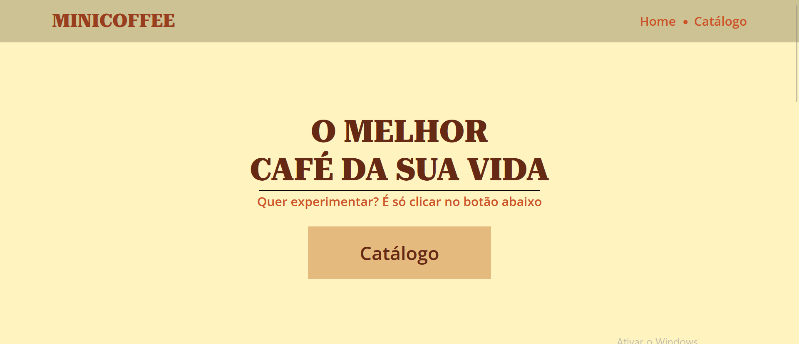

<h1 align="center">MiniCoffee</h1>

<div align="center">
    
    <p></p>
    
</div>
<p></p>

## ❓Sobre
Este projeto, feito em React, se trata de um site de uma cafeteria bem simples, na qual explora algumas bibliotecas para React e conceitos de responsividade e UX/UI

## 📋Requisitos
Para poder utilizar este projeto, você precisa ter instalado:

- Node.js (v20.11.1 ou mais recente)
- Git (2.43.0 ou mais recente)

## ⚙️Como Utilizar
Assim que tiver os requisitos acima, você deve criar uma pasta para o seu projeto, e então abrir a sua IDE ou prompt de comando nesta pasta. Feito isso, precisa utilizar o seguinte comando para clonar este repositório:

```
git clone https://github.com/mini-niko/minicoffee.git
```

Ou se preferir, pode baixar o arquivo ZIP clicando [aqui.](https://github.com/mini-niko/minicoffee/archive/refs/heads/main.zip)

Então, para utilizar o projeto, é necessário entrar com o terminal para dentro da pasta:

```
cd minicoffee
```

E para fazer funcionar, utilize o comando:

```
npm start
```

## Licensa
Este projeto pode ser utilizado apenas para fins pessoais e educacional. Não é permitido o uso comercial deste projeto.
